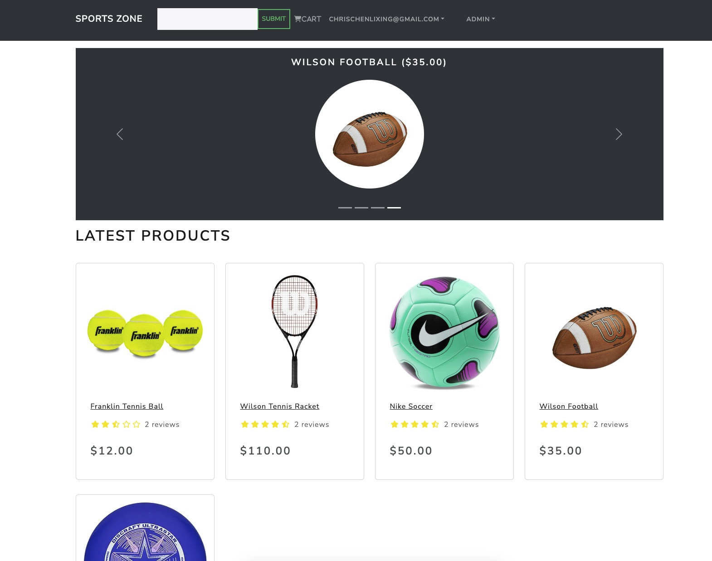
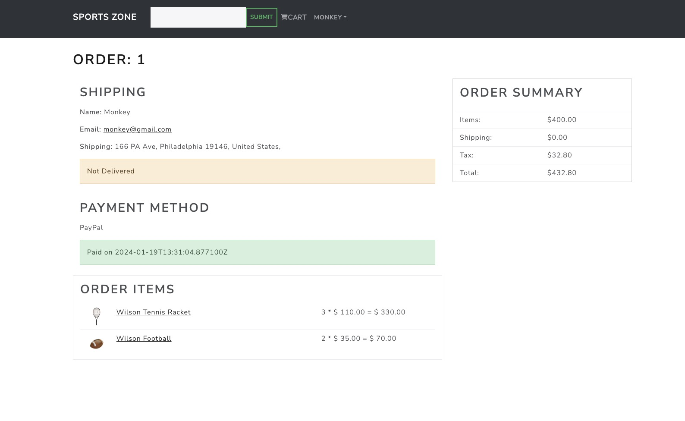
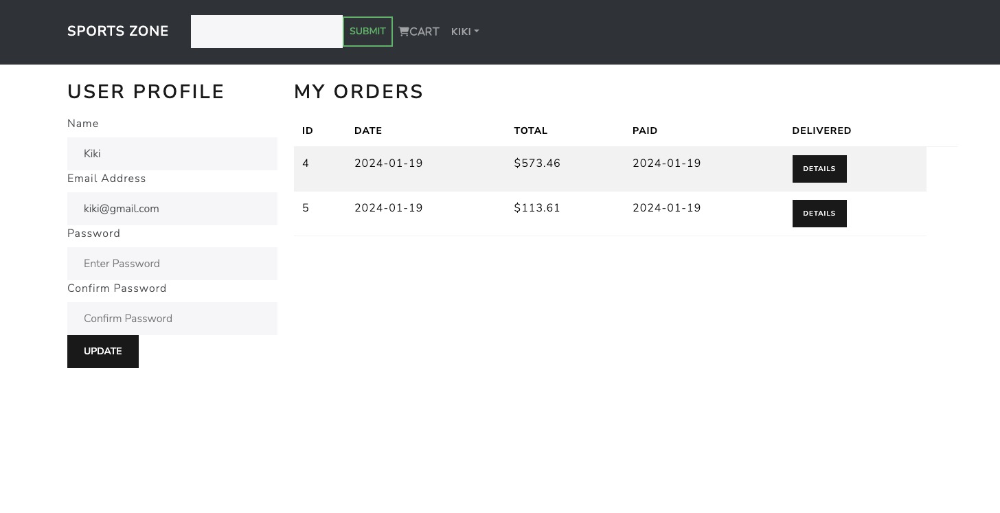
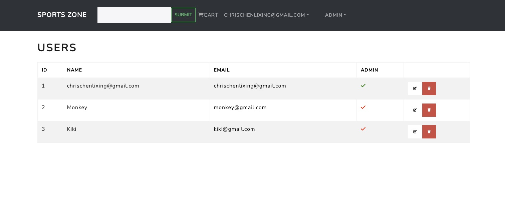
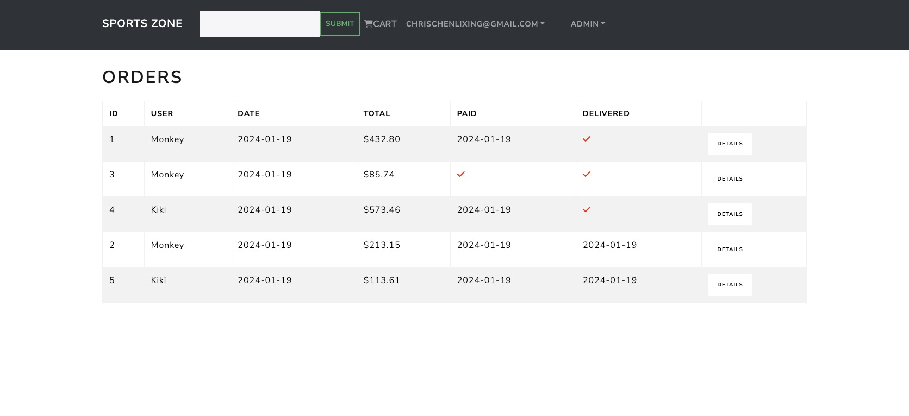

# eCommerce Platform Project

## Project Overview
This project involves building a comprehensive eCommerce platform from scratch, utilizing React, Redux for frontend development, and Django with Postgres for the backend. It's designed to simulate a real-world application, providing a robust understanding of full-stack development.
### User



### Admin



## Features

### Frontend
- **React & Redux Integration:** Utilizing React for the UI and Redux for state management.
- **Responsive Design:** Implementation of a responsive design using React-Bootstrap.
- **Shopping Cart:** Full-featured shopping cart with session management.
- **Product Rating & Review:** Allows users to rate and review products.

### Backend
- **Django Framework:** Backend built with Django to manage data and server-side logic.
- **Postgres Database:** Utilization of Postgres for efficient data storage and retrieval.
- **RESTful API:** Creation of a RESTful API for frontend-backend communication.
- **Admin Panel:** An admin interface to manage products, orders, and user data.

### Payments and Security
- **Payment Integration:** Integration with PayPal and credit/debit card payments.
- **JWT Authentication:** Implementation of JSON Web Token for secure user authentication.

## Project Structure

### `frontend/`
- Contains all React components, Redux actions, and reducers.
- `components/`: Individual UI components.
- `pages/`: React components representing full pages.
- `redux/`: Redux store, actions, and reducers.

### `backend/`
- Django project and application files.
- `models/`: Database models.
- `views/`: Backend logic to process API requests.
- `urls/`: Endpoint definitions for the API.

## Getting Started

### Prerequisites
- Node.js
- Python
- Django
- PostgreSQL

### Installation
1. Clone the repository:
   ```bash
   git clone https://github.com/your-repository/eCommerce-platform.git
2. Install frontend dependencies
   ```bash
   cd frontend
   npm install
3. Install backend dependencies
   ```bash
    cd backend
    pip install -r requirements.txt
4. Start the Django backend server
   ```bash
   python manage.py runserver
5. Start the React frontend
    ```bash
    npm start

The application should now be running on localhost:3000.